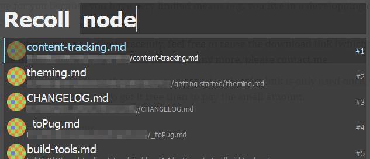

# Keypirinha-Recoll

[Recoll](https://www.lesbonscomptes.com/recoll/) is a desktop full-text search tool.

This plug-in lets you search the Recoll index from keystroke launcher [Keypirinha](http://keypirinha.com/) and directly open the file from there.

Install via <https://github.com/ueffel/Keypirinha-PackageControl>[1]

Type `Recoll` and select **Recoll - Queries the recoll index**, then type in the term you are searching for. 

Thanks to [@ueffel](https://github.com/ueffel/) for writing the majority of the code for this plugin.

## Settings

- Set `file_path` to `recoll.exe` if it's not in the default install path `"C:\\Program Files (x86)\\Recoll\\recoll.exe"`

## TODO

I tried to make additional Recoll command line arguments work (like change default sorting or ALL/ANY search or define a specific search index to be used), but it didn't work right away. At the end of the day, I think it's enough to perform a broad search via Keypirinha.

In case you want to refine your search, you can [launch the Recoll GUI from Keypirinha with command line arguments](http://keypirinha.com/first.html#specify-arguments) and go from  there.

[1]: [there](https://github.com/ueffel/Keypirinha-PackageControl#manually) you will also find how to install packages manually
